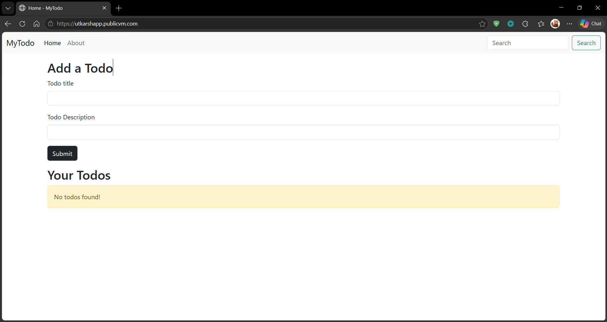
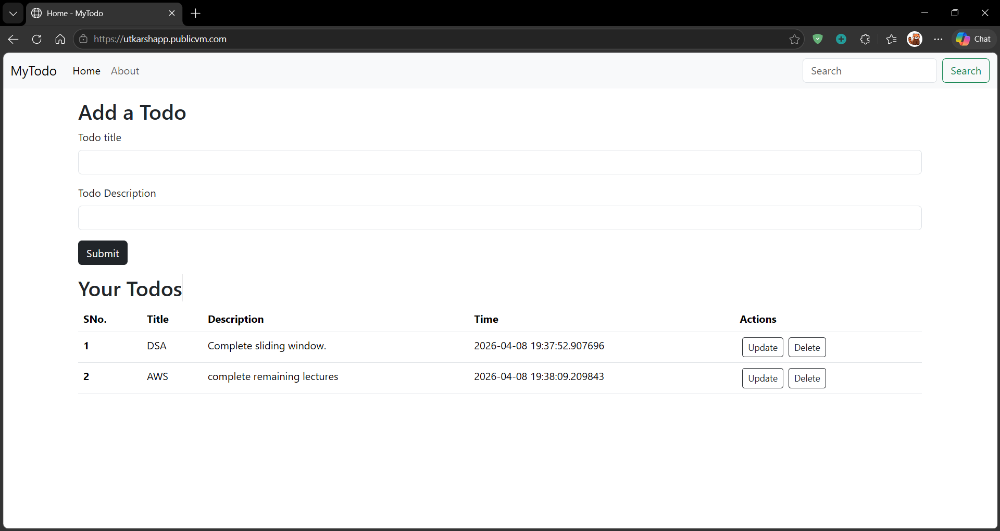

# 🚀 Flask Todo App with Full CI/CD Pipeline (Docker + AWS + Nginx)

A production-ready Todo web application built using Flask, containerized with Docker, deployed on AWS EC2, and automated using GitHub Actions CI/CD.

---

## 🌐 Live Demo
🔗 https://utkarshapp.publicvm.com

---

## 📸 Features Preview

### 🏠 Home Page


### ➕ Add Todo


---

## 🧱 Tech Stack

- Backend: Flask (Python)
- Containerization: Docker
- CI/CD: GitHub Actions
- Cloud: AWS EC2
- Web Server: Nginx
- Domain: Free DNS (publicvm.com)

---

## ⚙️ Architecture

User → Domain → Nginx → Docker Container → Flask App  
                                ↑  
                     GitHub Actions (CI/CD)

---

## 🚀 Features

- Add, update, delete Todos
- Dockerized Flask application
- Automated CI/CD pipeline
- Zero manual deployment
- Reverse proxy using Nginx
- Live public deployment on EC2

---

## 🔄 CI/CD Workflow

1. Code pushed to GitHub
2. GitHub Actions builds Docker image
3. Image pushed to Docker Hub
4. EC2 pulls latest image
5. Old container removed
6. New container deployed automatically

---

## 🔒 Security (HTTPS Enabled)

- Configured HTTPS using SSL certificates
- Used Certbot (Let's Encrypt) for free SSL
- Nginx configured to handle secure traffic
- Automatic HTTP → HTTPS redirection

---

## 🐳 Docker Commands (Local)

```bash
docker build -t todo-flask-app .
docker run -p 5000:5000 todo-flask-app